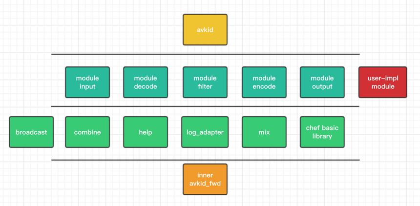
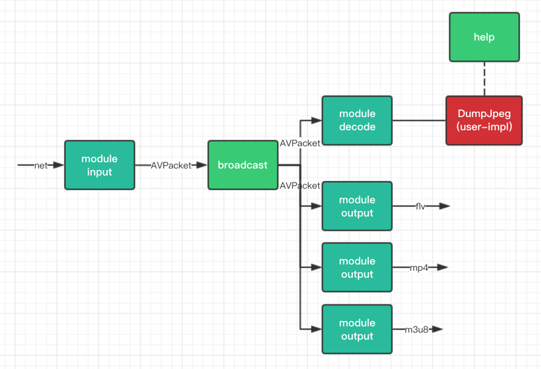

# avkid

avakid是我近期学习ffmpeg，在ffmpeg之上实现的小型框架。

目前聚焦于直播相关的业务，在avkid库之上，我构建了截图、录播、切片、转码、转推、合流、视频效果处理等demo。

### 特性

* api尽量简单，隐藏细节
* 不过度封装（比如width、height以及其他参数的取舍）
* module化，易于复用、维护、测试
* 所有对象生命周期自动化管理
* av数据管理，内存优化，无多余拷贝，零泄漏
* 所有module支持同步/异步，只需配置一个参数，其他无差别
* 所有module支持音视频单独控制
* 支持设置时长
* 支持超时
* 输入输出支持 http-flv / rtmp / mp4 / m3u8 （其他格式待测试）

### avkid的源码文件结构图



### 流媒体数据

流媒体的数据可以从内容和格式两个维度进行分类

内容：

* Audio 音频
* Video 视频

格式：

- original 原始未编码（或已解码）
- encoded 已经编码

一切算法（或者说策略、操作、逻辑）都是服务于数据。ffmpeg中与音视频数据最相关的两个数据结构：

* AVFrame 对应original
* AVPacket 对应encoded

TODO 补充，说明封装格式，以及mux，demux

### module

avkid中各module的输入输出


使用：module与module之间，只要输入输出的格式匹配，就可以挂载（avkid中的combine概念）

用户可以写自己的module，只需实现对应的接口即可

#### Broadcast

一个module可以挂载多个module


#### 构建演示应用

##### 1. 录制

不需要编解码，演示一个最简单应用需要的代码


##### 2. 一进多出

演示如何combine用户自己实现的module，以及如果利用Broadcast将一个module和多个module进行挂载。

拉一路流，截图，并分别录制flv，mp4，m3u8三份文件。那么想象一下，我们可以十分方便的做多路码流转码



##### 3. 将视频转化成黑白，上下或左右翻转（还没尝试的打水印、高斯处理等等）

利用了filter模块。ffmpeg提供了非常多的filter可供使用，我们只需要传入对应的字符串命令即可。

图省略，简单看下代码。

演示通过desc参数做各种视频效果

基于avkid模块化可插拔的特性，我们可以在任意环节对AVFrame做filter操作。比如录制黑白视频或截黑白的图片。

实际上，AVFrame可玩的花样很多，而且可以是链式的。

链式combine的好处

##### 4. 合流

演示如何更自由的组合avkid module，以及业务方如何插入自己的处理逻辑


### 代码走读

#### 挂载的几种方式

1. 实现对应接口，调用combine函数
2. 使用COMBINE宏，灵活的挂载方式
3. 直接调用do_data函数
4. broadcast

#### 合流

1. 音频
2. 视频

#### AVFrame 和 AVPacket 的生命周期管理

1. 结合avkid中的封装
2. 发送nullptr

#### FAQ

##### Q：为什么在avkid中AVFrame和AVPacket的传递prop全部用了拷贝，而data全部用了ref

A：开销，正确性，业务方自由性

##### Q：为什么在Encode和Output中都需要设置宽高

A：模块化

##### Q：为什么要提供broadcast而不直接把module中的handler弄成数组

A：正确易用性，扩展业务的支持性

##### Q：为什么MixManager不在avkid内部实现

##### Q：对应视频，我有无数种业务需求

A：如果我认为需求足够普遍，那么可能会提供一个HelpOP的函数，如果不是，那么就需要业务方自己操作AVFrame。可通过实现AVFrame到AVFrame的module来接入。

比如cut_video

### ffmpeg

#### 各lib介绍

http://ffmpeg.org/documentation.html

#### avfilter 介绍

#### pts dts

#### AVFrame 和 原始内存块互相转换

#### planar packed

#### 冗余初始化，，

```
AVPacket pkt = {0};

AVPacket pkt;
av_init_packet(&pkt);

AVPacket *pkt = av_packet_alloc();
```

### 我的环境

ffmpeg version 3.4.2

Apple LLVM version 8.0.0 (clang-800.0.42.1)

Darwin xxx.local 15.6.0 Darwin Kernel Version 15.6.0: Thu Jun 23 18:25:34 PDT 2016; root:xnu-3248.60.10~1/RELEASE_X86_64 x86_64

