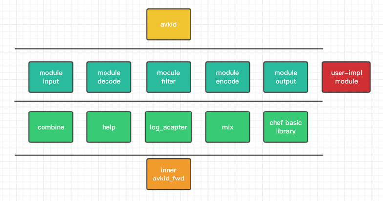
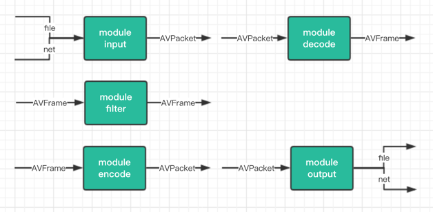
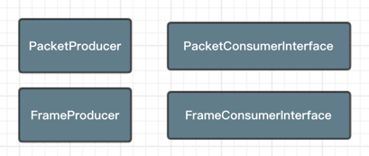
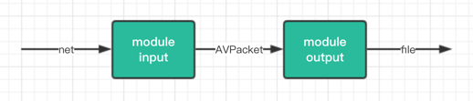
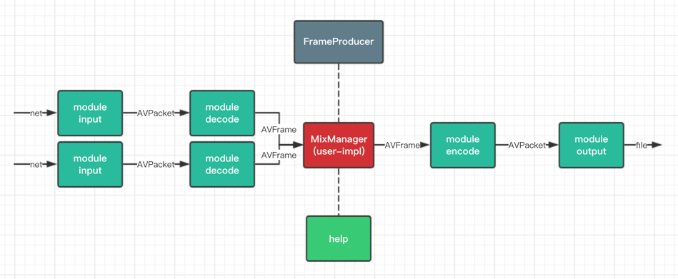

# avkid

基于ffmpeg的小型框架，目前聚焦于直播相关的业务（截图、录播、转码、合流等）。

### 特性

* api尽量简单，隐藏细节
* 不过度封装（比如width、height以及其他参数的取舍）
* module化，易于复用、维护、测试
* 所有对象生命周期自动化管理
* av数据管理，内存优化，无多余拷贝，零泄漏
* 所有module支持同步/异步，只需配置一个参数，其他无差别
* 所有module支持音视频单独控制
* 支持设置时长
* 支持超时

### avkid的源码文件结构图

### 流媒体数据

流媒体的数据可以从内容和格式两个维度进行分类

内容：

* Audio 音频
* Video 视频

格式：

- original 原始未编码（或已解码）
- encoded 已经编码

一切算法（或者说策略、操作、逻辑）都是服务于数据。ffmpeg中与音视频数据最相关的两个数据结构：

* AVFrame 对应original
* AVPacket 对应encoded

TODO 补充，说明封装格式，以及mux，demux

### module

avkid中各module的输入输出

使用：module与module之间，只要输入输出的格式匹配，就可以挂载（avkid中的combine概念）

用户可以写自己的module，只需实现对应的接口即可

#### 构建应用

##### 1. 录制

不需要编解码，展示一个最简单应用需要的代码

##### 2. 截图

展示如何combine用户自己实现的module

图省略，简单看下代码。

链式combine

##### 3. 将视频转化成黑白，上下或左右翻转（还没尝试的打水印、高斯处理等等）

利用了filter模块。ffmpeg提供了非常多的filter可供使用，我们只需要传入对应的字符串命令即可。

图省略，简单看下代码。

基于avkid模块化可插拔的特性，我们可以在任意环节对AVFrame做filter操作。比如录制黑白视频或截黑白的图片。

实际上，AVFrame可玩的花样很多，而且可以是链式的。

##### 4. 合流

演示如何更自由的组合avkid module，以及插入业务方的处理逻辑

### 代码走读

#### 挂载的几种方式

1. 实现对应接口，调用combine函数
2. 使用COMBINE宏，灵活的挂载方式
3. 直接调用do_data函数

#### 合流

1. 音频
2. 视频

#### AVFrame 和 AVPacket 的生命周期管理

1. 结合avkid中的封装
2. 发送nullptr

#### 其他

TODO

### ffmpeg

#### 各lib介绍

http://ffmpeg.org/documentation.html

#### avfilter 介绍

#### pts dts
